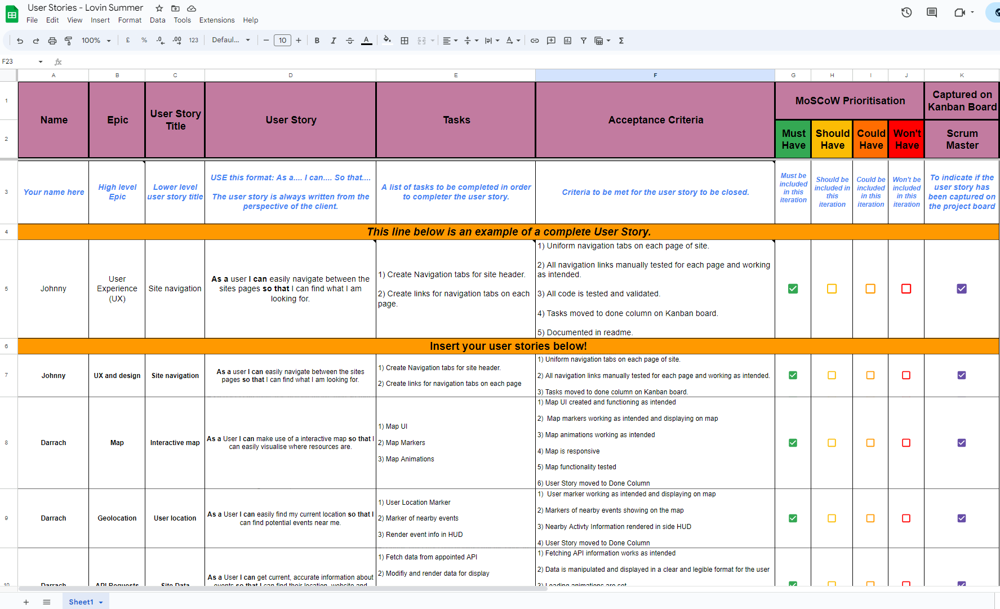
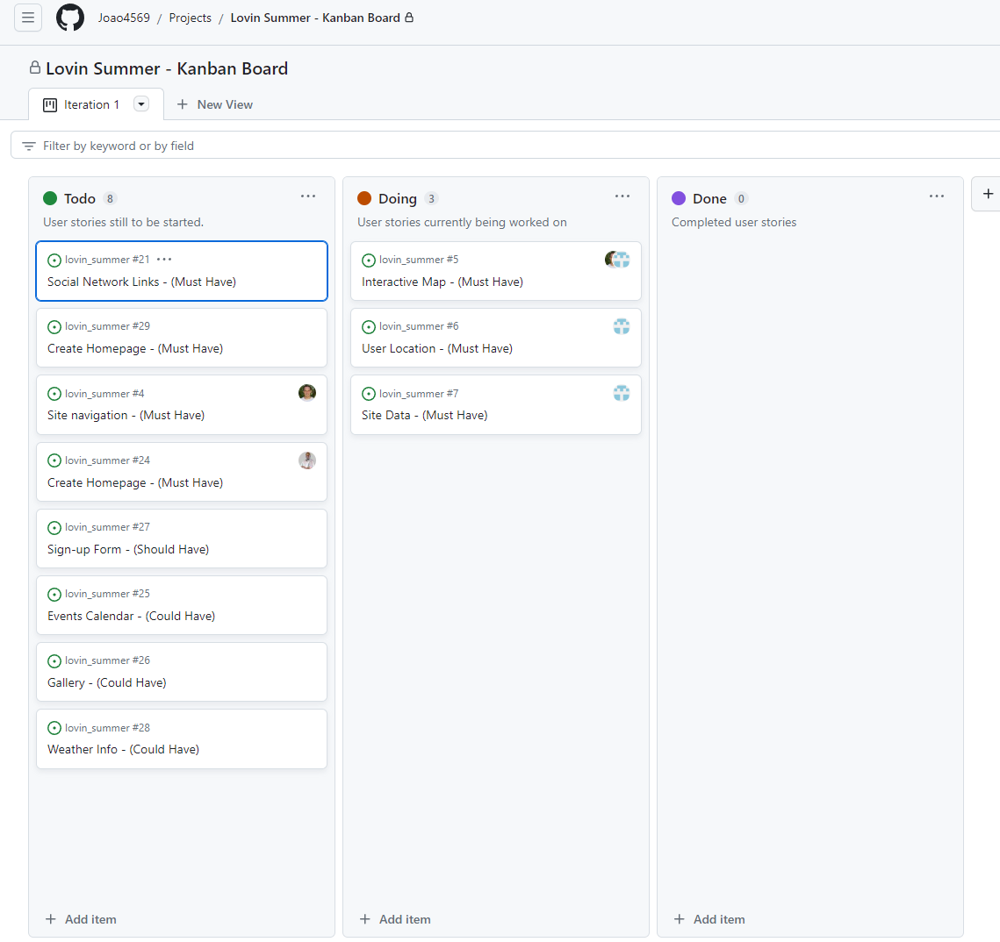
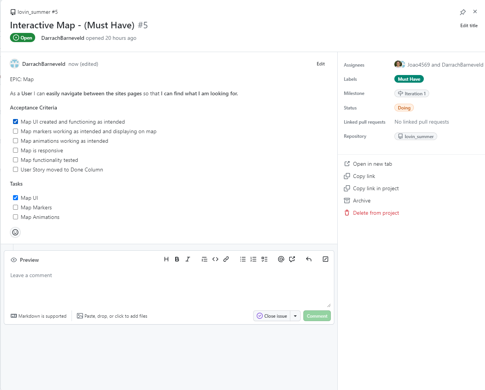

<h1 align="center"><strong>🌞🚵 Summer of Code 🏄🏖️</strong>

</h1>


# SUBMISSION
## Deployment
#### _(please note, your team must also include the deployed links in the usual submission in Hackapp)_
This project was deployed using [Netlify](https://app.netlify.com/) and can be accessed at [this address](https://musical-kataifi-25a4e4.netlify.app/).

## Criteria

The team put special emphasis on creating a 100% mobile-first design. From the early planning stages, we focused on this aspect, designing an interface and user experience that adapts seamlessly to mobile devices. To achieve this, we employed responsive design principles and utilized libraries like Bootstrap.

The application uses browser location to detect our position and display it on an interactive map with events, attractions, and activities around us. The use of device cameras has not been considered in this project. 

**Someone should add some information how browser location works, just one or two lines**

The project aligns perfectly with the theme of the hackathon, which is to encourage people to get out of their homes and enjoy the summer. The app offers various tourist attractions, events, and activities to explore.

Agile methodologies have been employed through GitHub Projects. Different tasks for the project were created and assigned to various team members. Once each task was completed, they were moved to the "Done" section. As code modifications were made, the corresponding pull requests were created and approved by the Scrum Master.

**The next part is not done yet**
- ✨ Presentation Quality - Present as if you are pitching it to client

# ABOUT SUBMISSION
## Intro
This project has been carried out with the intention of promoting healthy habits and fostering the connection among users of the application. The application is based on outdoor activities in Ireland and provides a source of information and resources for those interested in healthy lifestyle habits.

The web application is divided into three pages:
* Landing page: where the introduction to the website is located, and various articles that can be accessed.
* A interactive map serves for user geolocation and allows us to display attractions and events around us.
* Contact page where a form is included to easily get in touch with Lovin Summer.

## Agile Management Tools

We made use of the built in GitHub "Issues" and "Projects" functionality in order to create a Kanban board with User Stories for an efficient and clear Agile workflow while developing our project. We also made use of a custom Google Sheet for capturing the team's user stories which assisted the Scrum Master in managing the groups contributiions to the board.



This is the Google Sheet that we made use of with all the information required to create a complete User Story for the Kanban board.



This is the Kanban board that we made use of for managing our User Stories and workflow, it findicates which User Stories are still to do, in progress or completed.



Here is a sample of a user story which indicates the MoSCow Prioritisation, the milestone, the assigned developer as well as the tasks and criteria completed by means of checkboxes.

At a glance any developer could see what is still needed and contribute accordingly.

## Goal
The goal of the Lovin Summer project is to provide a comprehensive and user-friendly web application, with a strong focus on mobile design, that offers an immersive platform for discovering and exploring Ireland during the summer season. 

* **Problem Statement:** As a user, one of the most significant challenges during the summer is finding reliable and up-to-date information about local attractions, cultural events, and exciting outdoor activities scattered across Ireland. 

* **Objective(s):** Lovin Summer is committed to bringing accurate insights, especially regarding all the events and activities surrounding the user. The primary objective is to create a platform that becomes your ultimate go-to source for all things summer in Ireland. The second objective is to cover both if you're seeking beach parties, music festivals, or hiking spots. 

* **Target Audience:** Everyone with a thirst for adventure and a love for Irish summer vibes. This App is tailored for both tourists visiting Ireland for the first time and residents looking for new places to explore within the country. 

* **Benefits:** With geolocation integration, Lovin Summer offers a real-time connection between individuals engaging in outdoor activities and summer events. Additionally, embracing the Irish summer's breathtaking landscapes and engaging in its vibrant cultural scene can lead to substantial mental and physical well-being benefits.


## Tech
In the tech section, we provide information about the technology stack, dependencies, and any technical details related to the project.

To log into the Heroku toolbelt CLI:

1. Log in to your Heroku account and go to *Account Settings* in the menu under your avatar.
2. Scroll down to the *API Key* and click *Reveal*
3. Copy the key
4. In Gitpod, from the terminal, run `heroku_config`
5. Paste in your API key when asked

You can now use the `heroku` CLI program - try running `heroku apps` to confirm it works. This API key is unique and private to you so do not share it. If you accidentally make it public then you can create a new one with _Regenerate API Key_.

## Credits
We would like to give credit to the following individuals, organizations, and resources that have contributed to the project or provided inspiration:

[Hero image](https://www.cntraveller.com/gallery/places-to-visit-ireland) prvided by **© Condé Nast Britain 2023**  
[Ireland map](https://www.shutterstock.com/es/image-vector/cartoon-map-ireland-1013843395) provided by **© 2003-2023 Shutterstock, Inc.**  
[Healthy benefits](https://www.healthline.com/health/health-benefits-of-being-outdoors) provided by **Healthline Media a Red Ventures Company**  
[Sports](https://theculturetrip.com/europe/ireland/articles/where-you-can-play-sports-in-dublin/) provided by **The Culture Trip Ltd**  
[Festival dragon](https://eaf.ie/about) provided by **© 2023 Earagail Arts Festival**  
[Hiking routes](https://www.hillwalktours.com/walking-hiking-blog/hiking-in-ireland-most-beautiful-multi-day-walking-routes/) provided by **Hillwalktours**  
[Electric picnic](https://www.electricpicnic.ie/news/sign-up-for-tour-de-picnic-2023/) provided by **© Festival Republic 2023**  


------

## Release History

We continually tweak and adjust this template to help give you the best experience. Here is the version history:
------

## FAQ about the uptime script

**Why have you added this script?**

It will help us to calculate how many running workspaces there are at any one time, which greatly helps us with cost and capacity planning. It will help us decide on the future direction of our cloud-based IDE strategy.

**How will this affect me?**

For everyday usage of Gitpod, it doesn’t have any effect at all. The script only captures the following data:

- An ID that is randomly generated each time the workspace is started.
- The current date and time
- The workspace status of “started” or “running”, which is sent every 5 minutes.

It is not possible for us or anyone else to trace the random ID back to an individual, and no personal data is being captured. It will not slow down the workspace or affect your work.

**So….?**

We want to tell you this so that we are being completely transparent about the data we collect and what we do with it.

**Can I opt out?**

Yes, you can. Since no personally identifiable information is being captured, we'd appreciate it if you let the script run; however if you are unhappy with the idea, simply run the following commands from the terminal window after creating the workspace, and this will remove the uptime script:

```
pkill uptime.sh
rm .vscode/uptime.sh
```

**Anything more?**

Yes! We'd strongly encourage you to look at the source code of the `uptime.sh` file so that you know what it's doing. As future software developers, it will be great practice to see how these shell scripts work.

---

Happy coding!

Just added line here to check if I can create pull request - Szymon.
