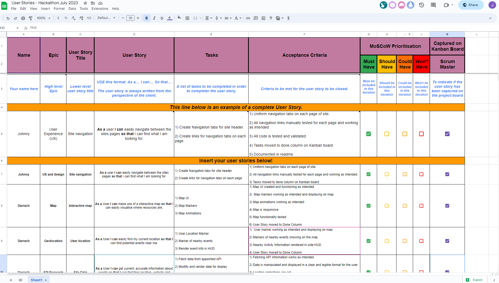
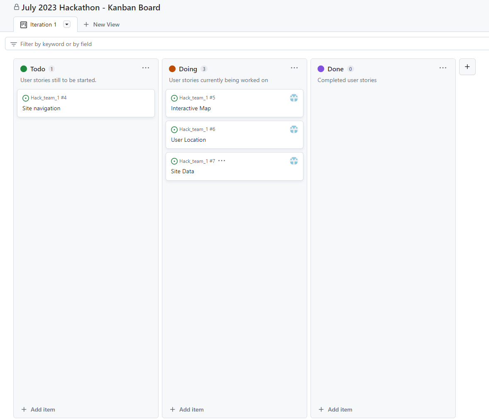
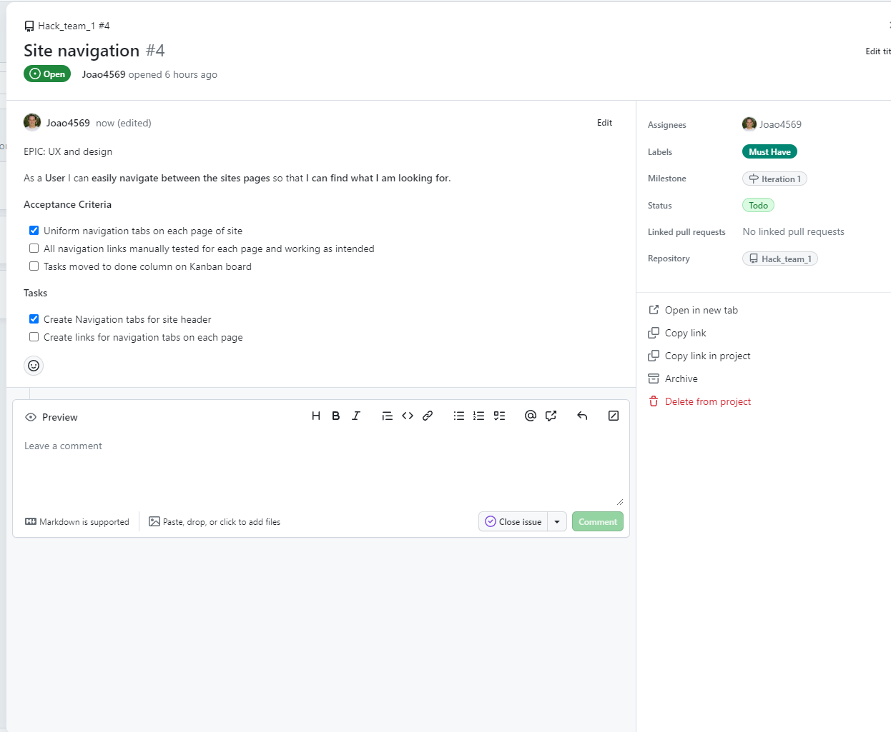

<h1 align="center"><strong>🌞🚵 Summer of Code 🏄🏖️</strong>

</h1>


# SUBMISSION
## Deployment
#### _(please note, your team must also include the deployed links in the usual submission in Hackapp)_
The project is deployed and can be accessed at [http://your-deployed-link.com](http://your-deployed-link.com).

## Criteria
In this section, we will briefly discuss how our team addressed the applicable criteria:

- ✨ Project is 100% Mobile First
- ✨ Project uses browser location or device camera
- ✨ Project aligns well to the Hackathon Theme
- ✨ Clear use of Github Projects or other agile tool
- ✨ Presentation Quality - Present as if you are pitching it to client

# ABOUT SUBMISSION
## Intro
One or two paragraphs providing an overview of our project

## Agile

We made use of the built in GitHub "Issues" and "Projects" functionality in order to create a Kanban board with User Stories for an efficient and clear Agile workflow while developing our project. We also made use of a custom Google Sheet for capturing the team's user stories which assisted the Scrum Master in managing the groups contributiions to the board.



This is the Google Sheet that we made use of with all the information required to create a complete User Story for the Kanban board.



This is the Kanban board that we made use of for managing our User Stories and workflow, it findicates which User Stories are still to do, in progress or completed.



Here is a sample of a user story which indicates the MoSCow Prioritisation, the milestone, the assigned developer as well as the tasks and criteria completed by means of checkboxes.

At a glance any developer could see what is still needed and contribute accordingly.

## Goal
The goal section provides a concise summary of the main objective or purpose of the project or software described in this README. It addresses the following aspects:

- ➡️ Problem Statement
- ➡️ Objective(s)
- ➡️ Target Audience
- ➡️ Benefits

## Tech
In the tech section, we provide information about the technology stack, dependencies, and any technical details related to the project.

To log into the Heroku toolbelt CLI:

1. Log in to your Heroku account and go to *Account Settings* in the menu under your avatar.
2. Scroll down to the *API Key* and click *Reveal*
3. Copy the key
4. In Gitpod, from the terminal, run `heroku_config`
5. Paste in your API key when asked

You can now use the `heroku` CLI program - try running `heroku apps` to confirm it works. This API key is unique and private to you so do not share it. If you accidentally make it public then you can create a new one with _Regenerate API Key_.

------

## Release History

We continually tweak and adjust this template to help give you the best experience. Here is the version history:
------

## FAQ about the uptime script

**Why have you added this script?**

It will help us to calculate how many running workspaces there are at any one time, which greatly helps us with cost and capacity planning. It will help us decide on the future direction of our cloud-based IDE strategy.

**How will this affect me?**

For everyday usage of Gitpod, it doesn’t have any effect at all. The script only captures the following data:

- An ID that is randomly generated each time the workspace is started.
- The current date and time
- The workspace status of “started” or “running”, which is sent every 5 minutes.

It is not possible for us or anyone else to trace the random ID back to an individual, and no personal data is being captured. It will not slow down the workspace or affect your work.

**So….?**

We want to tell you this so that we are being completely transparent about the data we collect and what we do with it.

**Can I opt out?**

Yes, you can. Since no personally identifiable information is being captured, we'd appreciate it if you let the script run; however if you are unhappy with the idea, simply run the following commands from the terminal window after creating the workspace, and this will remove the uptime script:

```
pkill uptime.sh
rm .vscode/uptime.sh
```

**Anything more?**

Yes! We'd strongly encourage you to look at the source code of the `uptime.sh` file so that you know what it's doing. As future software developers, it will be great practice to see how these shell scripts work.

---

Happy coding!
